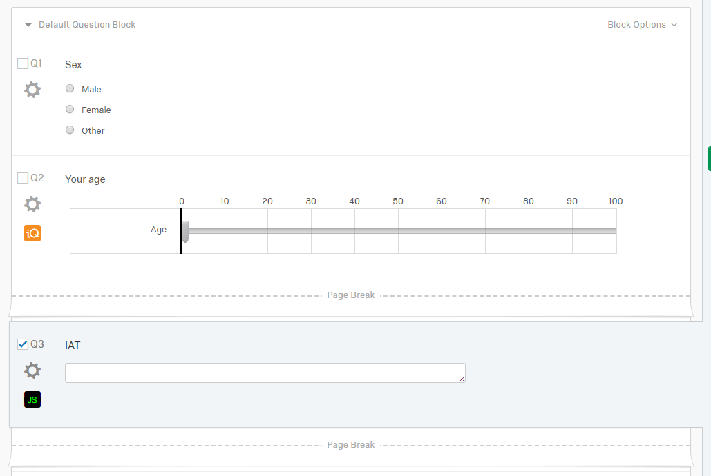
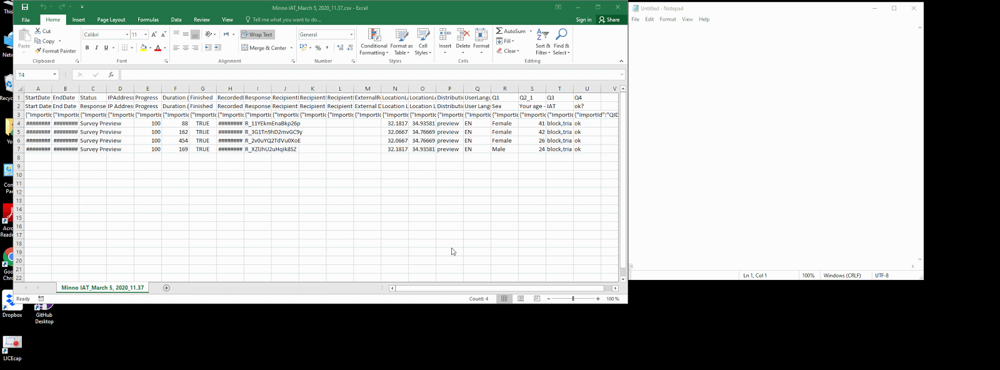

[Project Implicit](http://projectimplicit.net/) has developed [MinnoJS](https://minnojs.github.io/) to program web studies. 
The main instrument that we use in Project Implicit is the Implicit Association Test (IAT). 
The IAT is a commonly used indirect measure of social cognition (read more about such measures [here](https://www.tau.ac.il/~baranan/imp.html)). 
If you reached this blog post, you probably know what the IAT is and you want to use it in your own study. In this blog post, I will explain how you can use our script in a Qulatrics study. 

### Project Implicit's MinnoJS IAT extension 
We will use a [modification](https://baranan.github.io/minno-tasks/quiat8.js) of an IAT MinnoJS [script](https://cdn.jsdelivr.net/gh/baranan/minno-tasks@0.*/IAT/iat8.js) that Project Implicit has developed. In Project Implicit, we use that script to run the study from Open Minno Suite, our platform for running web studies. Before you decide to use that script in Qualtrics, please consider using our free platform as an alternative to Qualtrics (you can read more about it here). 

The script that we created for building IATs is an extension, implemented as a function that creates an IAT from a few arguments (i.e., parameters) that the researcher defines. You can read more about the basic idea of using extensions in Minno on [this page](https://github.com/baranan/minno-tasks/blob/master/implicitmeasures.md).

### Into Qualtrics
To run an IAT on Qualtrics study, I followed the guide from an earlier [post](https://minnojs.github.io/minnojs-blog/qualtrics/). 
The IAT will run from a single question in your survey, separated from any other question by a Page Break, like this:


Then, click the JS icon in the IAT question, and add the following code: 
```js
Qualtrics.SurveyEngine.addOnload(function () {
    // hide question and next button
    var container = this.getQuestionContainer();
    container.querySelector('.Inner').style.display = 'none';
    this.hideNextButton();

    // load MinnoJS from the CDN (you probably don't need to change this)
    var scriptTag = document.createElement('script');
    scriptTag.src = 'https://cdn.jsdelivr.net/gh/minnojs/minno-quest@0.3/dist/pi-minno.js';
    scriptTag.onload = onLoad;
    scriptTag.onreadystatechange = onLoad;
    container.appendChild(scriptTag);

    // create the root element for Minno
    var canvas = document.createElement('div');
    container.appendChild(canvas);

    // function to proceed to next question
    var proceed = this.clickNextButton.bind(this);

    // This function gets activated only after MinnoJS is loaded
    function onLoad() {
        // Run your study (just set the correct URL)
        minnoJS(canvas, 'https://baranan.github.io/minno-tasks/exampleQIAT.js');

        // MinnoJS doesn't know about Qualtrics, we pass a function to inject the results into the question
        // For some reason `piGlobal` isn't available so we attach it to `minnoJS`
        minnoJS.logger = function (value) {
            var el = container.querySelector('textarea');
            el.value = value;
        }

        // At the end of the study let MinnoJS proceed to the next question
        // We need to wait a few miliseconds for Qualtrics to register the value that we entered
        minnoJS.onEnd = function () { setTimeout(proceed, 100); }
    }
});
```

This code will run our example Qualtric IAT from this page. Start with that example. After you verify that it runs fine on your Qualtrics survey, replace it with your own IAT (we’ll get to that shortly). 

**IMPORTANT NOTE:** to skip blocks when you’re testing the IAT, use the key combination: Esc, Enter.

### How we define the IAT

If you go to [our example](https://baranan.github.io/minno-tasks/exampleQIAT.js), you will see how simple it can be to define your own IAT:
```js
define(['pipAPI', 'https://baranan.github.io/minno-tasks/quiat8.js'], function(APIConstructor, iatExtension){
    var API = new APIConstructor();

	return iatExtension({
		category1 : {
			name : 'Black people', //Will appear in the data.
			title : {
				media : {word : 'Black people'}, //Name of the category presented in the task.
				css : {color:'#31940F','font-size':'2em'}, //Style of the category title.
				height : 4 //Used to position the "Or" in the combined block.
			}, 
			stimulusMedia : [ //Stimuli content as PIP's media objects
    		    {image : 'black1.jpg'}, 
    			{image : 'black2.jpg'}, 
    			{image : 'black3.jpg'}, 
    			{image : 'black4.jpg'}, 
    			{image : 'black5.jpg'}, 
    			{image : 'black6.jpg'}
			], 
			//Stimulus css (style)
			stimulusCss : {color:'#31940F','font-size':'1.8em'}
		},	
		category2 :	{
			name : 'White people', //Will appear in the data.
			title : {
				media : {word : 'White people'}, //Name of the category presented in the task.
				css : {color:'#31940F','font-size':'2em'}, //Style of the category title.
				height : 4 //Used to position the "Or" in the combined block.
			}, 
			stimulusMedia : [ //Stimuli content as PIP's media objects
    		    {image : 'yf1.jpg'}, 
    			{image : 'yf4.jpg'}, 
    			{image : 'yf5.jpg'}, 
    			{image : 'ym2.jpg'}, 
    			{image : 'ym3.jpg'}, 
    			{image : 'ym5.jpg'}			], 
			//Stimulus css
			stimulusCss : {color:'#31940F','font-size':'1.8em'}
		},	

		base_url : {//Where are your images at?
			image : 'https://baranan.github.io/minno-tasks/images/'
		} 
	});
});
```
In the first line, we tell Minno where the [full IAT script](https://baranan.github.io/minno-tasks/quiat8.js) is:
`define(['pipAPI', 'https://baranan.github.io/minno-tasks/quiat8.js'], function(APIConstructor, iatExtension){`

At the beginning of [that script](https://baranan.github.io/minno-tasks/quiat8.js), 
you can see all the possible arguments (i.e., parameters for the IAT). 
The arguments are provided in a JavaScript [JSON](https://www.w3schools.com/js/js_json.asp) object. 
If you don’t want to change the default value of an argument, you don’t need to include that argument in your own script.
If you change even one parameter within a child object (i.e., within a property that is an object, such as the property *category2*), you must define the whole object in your own code (as we did with category1 and category2 in the example above). The only parameters that we changed in the example above are the categories (labels and stimuli) and the url for the folder that hosts the images. 

### Use your own script file

Next, it’s time to create your own IAT. For that, you need to create a script like the example script, and post it online. If you have your own website (e.g., a home directory hosted by your university), you can put that script on that website. It is a static file so pretty much any server will suffice. Or, you can use a free online service for that. My example is hosted on GitHub Pages, which is free and [easy to setup](https://help.github.com/en/github/working-with-github-pages/configuring-a-publishing-source-for-your-github-pages-site). 

First, just copy my code and put it on your server. Change the url in the JavaScript code you entered to Qualtrics earlier, and see that the IAT runs fine. 

### Define your IAT

Now, change your code to build the IAT you need. If you’re using photos, put them in your own directory and change your IAT script to search for images there: base_url: {image:’YOUR URL GOES HERE’}.
If you’re using words rather than photos, you need to update the [media](https://minnojs.github.io/minno-time/0.5/time/API.html#media) object of the categories. For instance: {word: 'Tyrone'}.

If you want to update the attributes, see how the attributes are defined in the [extension script](https://baranan.github.io/minno-tasks/quiat8.js) and override them by defining your own attributes in your IAT script.

Although our IAT script supports touch devices, the IAT does not detect automatically whether the participant is using a touch device (e.g., mobile). Therefore, if you want your participants to run the IAT on a mobile device or a tablet, you will need to create an IAT version specifically for those participants (in your script, set isTouch:true in the IAT parameters). 

### Processing the IAT data

The original [post](https://minnojs.github.io/minnojs-blog/qualtrics/) about running MinnoJS scripts from Qualtrics explains the how to process the data saved by Qualtrics. [Here](https://github.com/baranan/minno-tasks/blob/master/docs/minno.qualtrics.iat.process.rmd)([download from [here](https://baranan.github.io/minno-tasks/minno.qualtrics.iat.process.rmd)] is an R (well, rmd) script that you can use to analyze the IAT data. If you don’t feel comfortable using R, here is how to create a csv file with the IAT data, using Excel. 
1. Download the data from Qualtrics as csv.
2. Open the csv file with Excel
3. Copy only the cells with IAT data. For instance, because the IAT was in Q3 in my Qualtrics questionnaire, the relevant column is under Q3. Select only the cells with that data and copy those cells.
4. Open a notepad (or notepad++ or any other simple editor) and paste the data (the cells you copied) to that file.
5. Replace (usually, using ctrl-H) the text *“block,trial* with the text *block,trial* (to remove the “ before block)
6. Replace “”” (three double quotes) with “” (two double quotes)
7. Replace “” (two double quotes) with “ (one double quotes)
8. Save that file as a csv file
9. You can open that csv file to make sure that it is fine. 

The steps in an animated gif:


### Any questions?

If you have any questions, you post questions in our MinnoJS Google Group, [here](https://groups.google.com/forum/?utm_medium=email&utm_source=footer#!forum/minnojs). 

### Cite Us

You used MinnoJS platform, which is cited like this:

`Zlotnick, E., Dzikiewicz, A. J., & Bar-Anan, Y. (2015). Minno.js (Version 0.3) [Computer software].`

To cite our Qualtrics-IAT script, cite this blog post:

`Bar-Anan, Y. (2020, March 3). Running Project Implicit’s IAT from Qulatrics [Blog post]. Retrieved from https://minnojs.github.io/minnojs-blog/qualtrics-iat/`


